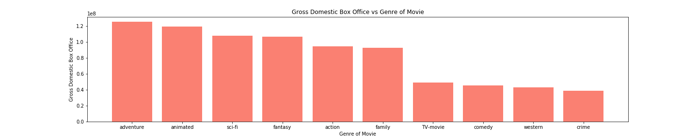
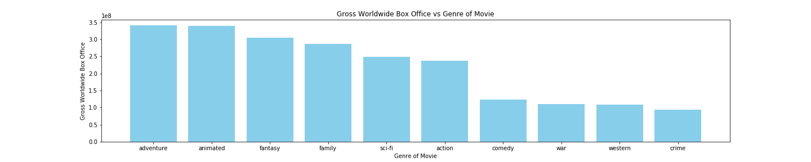

# Title

**Authors**: Student1, Student2

## Overview

A one-paragraph overview of the project, including the business problem, data, methods, results and recommendations.

 In this project our team's task is to look at movie data in order to discover insights that can help Microsoft be successful in the video content industry. The data used comes from websites that specialize in movies/tv-shows like Box Office Mojo, IMDb, Rotten Tomatoes, and TheMovieDB.org. The methods used in this research will focus on manipulating the current data in order to gain insight on what movies are successful, who is part of successful movies, and [INSERT LHAMU WORK]. The results below show that adventure, animated, and sci-fi movies are the genres that Microsoft should consider. It also shows the writers, actors, and directors who have been part of highly rated movies.

## Business Problem

Summary of the business problem you are trying to solve, and the data questions that you plan to answer in order to solve them.

Microsoft wants to join in on the other big companies starting to make video content like Netflix, Hulu, and many others. Without much experience in the field, they need our help with getting an insight into what kind of content they should be creating to be successful. The question we seek to answer are:
1. What genre of movie is the most successful domestically / worldwide?
2. Who should be hired to give the highest chance of a highly rated movie?

***
Questions to consider:
* What are the business's pain points related to this project?
* How did you pick the data analysis question(s) that you did?
* Why are these questions important from a business perspective?
***

## Data

Describe the data being used for this project.

The data used in this project comes from websites that specialize in movies/tv-shows and all information on those. The websites are Box Office Mojo, IMDb, Rotten Tomatoes, and TheMovieDB.org. In order to get a better understanding I am going to highlight the key components of each dataset.
1. **imdb.title.crew.csv.gz** - This contains the directors and writers for 146,000 movies. (146144 rows × 3 columns)
2. **tmdb.movies.csv.gz** - This conains IMDb information like rating, popularity, and id. Along with that it also has the genres, release date, and title. (26517 rows × 10 columns)
3. **imdb.title.akas.csv.gz** - This contains the titles used in other countries. (331703 rows × 8 columns)
4. **imdb.name.basics.csv.gz** - This contains the employess of the movie and their specfic role. (606648 rows × 6 columns)
5. **rt.reviews.tsv.gz** - This contains the reiews given on Rotten Tomatoes as well as the information about the reviewer. (54432 rows × 8 columns)
6. **imdb.title.basics.csv.gz** - This contains the general infomation on a movie like start year, runtime, and genres. (146144 rows × 6 columns)
7. **rt.movie_info.tsv.gz** - This contains the general information that Rotten Tomatoes provides. This includes a synopsis, rating, genre, directors, and much more. (1560 rows × 12 columns)
8. **tn.movie_budgets.csv.gz** - This contains the budget and gross income. (5782 rows × 6 columns)
9. **bom.movie_gross.csv.gz** - This contains the domestic and foreign gross. (3387 rows × 5 columns)
10. **imdb.title.principals.csv.gz** - This contains information on actors and the movies they were in. (1028186 rows × 6 columns)

#### Question 1
In order to answer question one, I will be using the **tmdb.movies.csv.gz** and **bom.movie_gross.csv.gz**. The reason for the **tmdb.movies.csv.gz** dataset is to access all movie titles along with their genre ids. The **bom.movie_gross.csv.gz** dataest will be used to access the domestic box office for every movie in that dataset. Box office is the total amount of money spent at movie theaters to see that specific movie. These two splices of the dataset will be combined to show the domestic box office per movie whihc will then be further processed to show box office based on genre.

#### Question 2
In order to answer question two, I will be using the **imdb.name.basics.csv.gz** and **imdb.title.ratings.csv.gz**. The **imdb.name.basics.csv.gz** will be used to access all the employees of movies along with their respective titles they are most known for. The **imdb.title.ratings.csv.gz** will be used to asign ratings to the movies that the employees are most known for. This will allow me to rank players based off the ratings of their most known movie.

#### Question 3


***
Questions to consider:
* Where did the data come from, and how do they relate to the data analysis questions?
* What do the data represent? Who is in the sample and what variables are included?
* What is the target variable?
* What are the properties of the variables you intend to use?
***

## Methods
Describe the process for analyzing or modeling the data. For Phase 1, this will be descriptive analysis.

#### Question 1
To be able to say what genre is the most successful a score needs to be assigned to each genre to be able to order them. What seems to be the best indicator for success is the box office of each movie. The box office will indicate how many people actually saw the movie rather than ratings that could be skewed due to personal preferences.

In order to assign a dollar amount to each genre, the movies must be the starting point because in the dataset each movie has an assigned list of genre id's. With this information we will assign each of those genre's associated with a that movie the total box office of the movie. This will then be done for every movie and after all movies have been processed each genre will have a list of amounts each movie made of that genre. The mean will taken in order to assign a single value to each of the genres.

#### Question 2
To be able to identify those who should be hired to maximize the success of a movie a score must be assigned to each person and then ranked based off that. In order to assign a score to each person I am going to assign them the average rating of the movies that they are known for. The list of movies that each person is known for is given by an IMDb dataset. By taking the average of the scores of the movies they appeared in it will give an indication of how good the movies are that they are a part of.

#### Question 3

***
Questions to consider:
* How did you prepare, analyze or model the data?
* Why is this approach appropriate given the data and the business problem?
***

## Results

Present your key results. For Phase 1, this will be findings from your descriptive analysis.

#### Question 1 (a)
The results of this inquiry shows that the American populations favorite genres of movies are adventure, animated, sci-fi, fantasy, action, and family. These top 6 genres have a significantly higher mean box office than all other genres. The top being adventure with a mean box office of $125,305,063. There are some outliers on the upper range that will impact this mean but I think that this is important to keep because it shows that adventure have the possibility of reaching much higher box office income than other genres.


#### Question 1 (b)
The results of this question shows that worldwide the genres of movies that have the highest mean box office are adventure, animated, fantasy, family, sci-fi, and action. These are very similar to the domestic box office from question 1 (a). The only difference is that the top 3-6 are in different positions but remain in the top 6. After this top 6 there is a dramatic drop off in mean worldwide box office. The top genre of adventure grossed on average $341,304,504 in the box office.


#### Question 2
The results here show that there are actors, actresses, directors, and writers who were a part of movies that were rated very highly. A note here is that this does not mean that if these highly rated personnel are a part of a movie it will receive a high rating. It means that they will give a higher chance of a movie being rated highly because they have shown they can produce highly rated work.

***
Questions to consider:
* How do you interpret the results?
* How confident are you that your results would generalize beyond the data you have?
***

Here is an example of how to embed images from your sub-folder:

### Visual 1


## Conclusions

Provide your conclusions about the work you've done, including any limitations or next steps.

***
Questions to consider:
* What would you recommend the business do as a result of this work?
* What are some reasons why your analysis might not fully solve the business problem?
* What else could you do in the future to improve this project?
***

## For More Information

Please review our full analysis in [our Jupyter Notebook](./dsc-phase1-project-template.ipynb) or our [presentation](./DS_Project_Presentation.pdf).

For any additional questions, please contact **name & email, name & email**

## Repository Structure

Describe the structure of your repository and its contents, for example:

```
├── README.md                           <- The top-level README for reviewers of this project
├── dsc-phase1-project-template.ipynb   <- Narrative documentation of analysis in Jupyter notebook
├── DS_Project_Presentation.pdf         <- PDF version of project presentation
├── data                                <- Both sourced externally and generated from code
└── images                              <- Both sourced externally and generated from code
```
